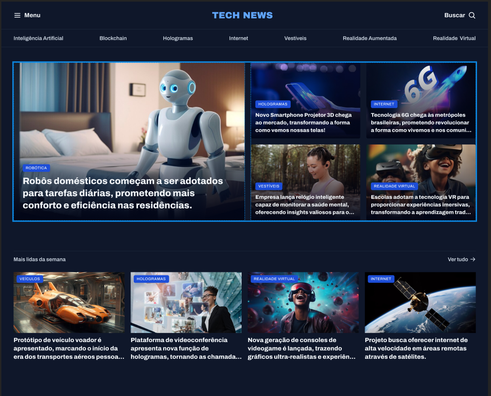

# 📰 Portal de Notícias

Um portal de notícias moderno e responsivo, desenvolvido com HTML e CSS, focado em apresentar as últimas novidades do mundo da tecnologia com um design limpo e organizado. O projeto simula uma página de notícias com seções como Inteligência Artificial, Realidade Virtual, Hologramas, entre outras.

## 🌐 Demonstração

> Acesse o repositório no GitHub: [Portal de Notícias](https://github.com/IsraellSan7os/Portal-de-Noticias)

---

## 🛠️ Tecnologias Utilizadas

- **HTML5**
- **CSS3**
- **Grid Layout**
- **Variáveis CSS**
- **Google Fonts (Archivo & Poppins)**

